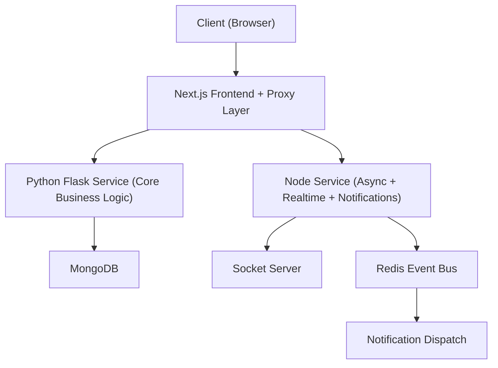
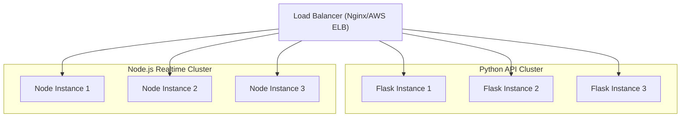

# Agile Project Management Platform — System Design

## 1. Overview

### Project

Agile Project Management Platform inspired by Jira.

This system is designed as a distributed backend platform that supports:

- Organizations
- Workspaces
- Boards
- Issues
- Notifications
- Metrics
- Authentication and Permissions
- Activity tracking
- Real-time updates
- Rate limiting
- Secure API communication

The goal is to build a scalable, secure, and resilient project management system capable of handling enterprise-level traffic and large-scale collaboration.

---

# 2. Design Goals

## Primary Goals

- Scalability
- Security
- Reliability
- Separation of concerns
- Real-time communication
- Event-driven architecture
- Clean service boundaries
- Production-ready structure

## Engineering Principles

- Domain separation
- Non-blocking architecture
- Secure authentication
- Horizontal scalability
- Modular services
- Fault tolerance
- Maintainability

---

# 3. High-Level Architecture

---
# 4. Architecture Explanation

The system is divided into **three major layers**:

## 1. Next.js Frontend and Proxy Layer

Responsibilities:

- User interface
- API proxy
- Token forwarding
- Request routing
- SSR/CSR handling
- Security boundary between client and backend

Why this design:

- Prevents direct backend exposure
- Centralizes API calls
- Secures authentication flow
- Improves control over requests

Engineering benefit:

> Next.js acts as a lightweight API gateway while still serving as the frontend.

---

## 2. Python Flask Service

Responsibilities:

- Authentication
- Authorization
- Organizations
- Users
- Workspaces
- Boards
- Permissions
- Security
- Rate limiting
- Redis caching
- Core CRUD logic

Key modules:

- auth.py
- permission.py
- rate_limiter.py
- security.py
- redis.py
- middleware.py
- models/

Why Python handles this:

- Centralized domain logic
- Strong security enforcement
- Controlled data access
- Stable service for business rules

Engineering reasoning:

> Core business logic should live in a stable, controlled service with strong security enforcement.

---

## 3. Node Service

Responsibilities:

- Issues
- Notifications
- Metrics
- Event Bus
- Subscribers
- Socket communication
- Notification dispatch

Key modules:

- issueController.js
- notificationController.js
- metrics.js
- eventBus.js
- subscriber.js
- dispatchNotification.js
- socket.js

Why Node handles this:

- Asynchronous operations
- Event-driven communication
- Real-time notification delivery
- Non-blocking architecture

Engineering reasoning:

> Event-heavy and real-time workloads should not block the core API.

---

# 5. Service Communication

## Request Flow

Client → Next.js → Flask Service → MongoDB

Client → Next.js → Node Service → MongoDB

Flask → Event Bus → Node

Node → Socket → Client

---

# Event Flow

User registers or performs action

Flask Service

Emit notification event

Event Bus

Node Subscriber receives event

Dispatch Notification

Socket sends to user

This ensures:

- non-blocking notification processing
- real-time updates
- service decoupling

---

# 6. Database Architecture

## MongoDB

Both Node and Python services share the same MongoDB instance.

### Why

- Centralized data
- Consistent state
- Simplified data management
- Easier coordination between services

---

## Data Ownership

Python owns:

- Users
- Organizations
- Workspaces
- Boards

Node owns:

- Issues
- Notifications
- Metrics

This creates clear service boundaries.

---

# 7. Redis Strategy

Redis is used in the Python service.

## Usage

- Rate limiting
- Authentication caching
- Temporary data storage
- Security enforcement
- Request throttling

## Flow

Client request

Flask checks Redis

If allowed → process request

If blocked → reject

---

## Benefit

- Prevents abuse
- Reduces load
- Improves performance
- Enhances security

---

# 8. Event-Driven Architecture

The system uses an internal event bus.

Key components:

- eventBus.js
- subscriber.js
- dispatchNotification.js

---

## Event Flow

Flask action

Emit event

Event Bus

Subscriber

Notification dispatch

Socket

Client receives update

---

## Benefits

- Decoupled services
- Non-blocking operations
- Scalable notifications
- Clean communication between services

---

# 9. Real-Time System

Socket communication allows:

- Instant notifications
- Real-time updates
- Live collaboration

---

## Scaling Strategy

To scale sockets:

- Redis Pub/Sub
- Kafka
- Load-balanced socket servers

---

# 10. Load Handling Strategy

## Current

Docker Compose

Multiple services

Separated responsibilities

---

## At 1 Million Users

### Add Load Balancer

This distributes traffic across instances.

---

# 11. Database Scaling

## Sharding

Split database:

Shard 1 → Users

Shard 2 → Organizations

Shard 3 → Workspaces

Shard 4 → Issues

Shard 5 → Notifications

---

## Read Replicas

Primary:

writes

Replicas:

reads

This improves performance.

---

# 12. Caching Strategy

Future Redis usage:

- workspace data
- user session
- recent issues
- notifications

Flow:

Client

API

Redis

MongoDB

---

# 13. Security Strategy

Implemented:

- JWT authentication
- Permission validation
- Rate limiting
- Secure middleware
- Redis-based request control
- Token verification
- Input validation

---

## Protection

- CSRF protection
- Token security
- Access control
- Request validation
- Secure proxy layer

---

# 14. Failure Handling

## Flask Failure

Node continues

Notifications still work

---

## Node Failure

Core API still works

Users can still interact

---

## Redis Failure

Fallback to MongoDB

Rate limiting temporarily relaxed

---

## MongoDB Failure

Events stored

Retry later

System degrades gracefully

---

# 15. Observability

Future additions:

- Prometheus
- Logging
- Monitoring
- Request tracing
- Performance tracking

---

# 16. Tradeoffs

## Single MongoDB Instance

Pros:

- Simplicity
- Easy coordination

Cons:

- Scaling limitation

Solution:

- Sharding
- Replication

---

## Python and Node Separation

Pros:

- Clean responsibilities
- Better performance
- Event-driven design

Cons:

- Service coordination required

Solution:

- Event bus
- Clear boundaries

---

# 17. Future Improvements

- Kafka for event streaming
- Kubernetes deployment
- API Gateway
- Circuit breakers
- Service mesh
- CQRS
- GraphQL layer
- Distributed Redis
- Centralized logging

---

# 18. Why This Design Is Strong

This system demonstrates:

- Distributed backend architecture
- Event-driven communication
- Secure authentication
- Real-time system
- Redis usage
- Rate limiting
- Socket communication
- Dockerized services
- Clean domain separation
- Scalability planning

This reflects production-level engineering thinking.

---

# 19. Conclusion

The system is designed with scalability, security, and reliability in mind.

The separation of:

- Python for core logic
- Node for async processing
- Next.js as proxy
- Redis for rate limiting
- MongoDB for storage
- Event bus for communication

creates a robust and extensible architecture suitable for enterprise-scale project management systems.

The architecture is prepared to scale to millions of users with the addition of load balancing  
